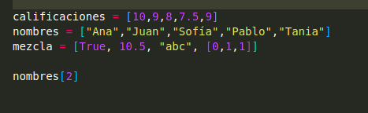
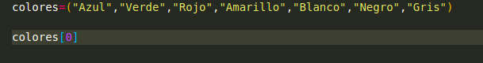
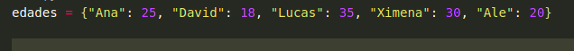

## Estructuras de datos
## Lista
###  Las listas son estructuras de datos que pueden almacenar cualquier otro tipo de dato, inclusive una lista puede contener otra lista, además, la cantidad de elementos de una lista se puede modificar removiendo o añadiendo elementos. Para definir una lista se utilizan los corchetes, dentro de estos se colocan todos los elementos separados por comas:

### las listas son iterables y por tanto se puede acceder a sus elementos mediante indexación,Se tiene la posibilidad de agregar elementos a una lista mediante el método append,El método remove elimina un elemento de una lista.

## Tuplas
### Las tuplas son secuencias de elementos similares a las listas, la diferencia principal es que las tuplas no pueden ser modificadas directamente, es decir, una tupla no dispone de los métodos como append o insert que modifican los elementos de una lista.Para definir una tupla, los elementos se separan con comas y se encierran entre paréntesis.

## Diccionario
### Los diccionarios son estructuras que contienen una colección de elementos de la forma clave: valor separados por comas y encerrados entre llaves. Las claves deben ser objetos inmutables y los valores pueden ser de cualquier tipo. Necesariamente las claves deben ser únicas en cada diccionario, no así los valores.Vamos a definir un diccionario llamado edades en el cual cada clave será un nombre y el valor una edad:

